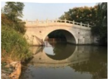
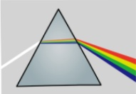
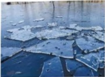
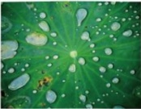
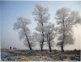

# 重庆市2023年初中学业水平暨高中招生考试

# 物理试题（A卷）

（全卷共四个大题：满分80分：与化学共用120分钟）

## 一、 选择题（本题共8个小题，每小题只有一个选项最符合题意，每小题3分，共24分。）

1. 下列物理量最接近实际的是（）

A. 托起两个鸡蛋的力约为  $ 500 \, N $

B. 水分子的直径约为  $ 10 \, m $

C. 我国家庭电路的电压约为  $ 36 \, V $

D. 人的正常体温约为  $ 37^{\circ}C $

2. 如图所示的光现象中，由于光的反射形成的是（）

A.

水中 倒影 B.

墙上的手影

C.

太阳光色散 D.

“折断”的铅笔

3. 如图所示，国画描绘的美景中蕴含了丰富的物态变化知识。以下分析正确的是（）

甲

乙

丙

丁

A. 图甲，湖面上厚厚的冰层是升华形成的

B. 图乙，荷叶上晶莹的露珠是凝固形成的

C. 图丙，山林间的缕缕薄雾是液化形成的

D. 图丁，枝头上的奇景雾凇是熔化形成的

4. 2023 年川渝田径赛在重庆奥体中心举行，图是 100m 短跑比赛的情境。以下描述正确的是（）