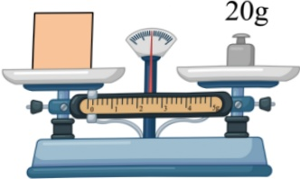
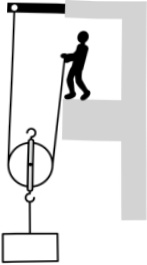

A. 运动员鞋底有凹凸不平的花纹是为了减小摩擦力

B. 运动员静止站立时受到的重力和支持力是平衡力

C 运动员快速冲刺使得周围空气流速变快压强变大

D. 运动员到达终点时受到惯性作用不能立即停下来

5. 关于电和磁的知识，下列说法正确的是（）

A. 用电器的金属外壳应按规定接地

B. 奥斯特发现了电磁感应现象

C. 用丝绸摩擦过的玻璃棒带负电荷

D. 同名磁极靠近时会相互吸引

6. 小明按托盘天平的使用要求，正确测量正方体木块的质量，天平平衡时，如图所示。下列说法正确的是（）

A. 天平的实质是省力杠杆

B. 被测木块的质量为 20.4g

C. 图中木块对托盘的压强小于砝码对托盘的压强

D. 测量结束后，可以直接用手将砝码放回砝码盒

7. 在美丽乡村建设的工地上，如图所示，工人借助动滑轮用  $ 250\,N $ 的拉力，将  $ 450\,N $ 的重物匀速提升  $ 2\,m $，用时  $ 10\,s $。则（）

