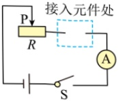
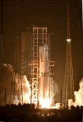

A. 重物上升的速度为  $ 0.4 \, m/s $

B. 动滑轮做的有用功为  $ 1000 \, J $

C. 工人的拉力的功率为  $ 90 \, W $

D. 动滑轮的机械效率为  $ 90\% $

8. 将一个定值电阻接入图甲所示电路的虚线框处，并将一个电压表（图中未画出）并联在某段电路两端，闭合开关，移动滑片 P，多次记录两电表示数；断开开关，只将定值电阻更换为小灯泡，再次获取数据并记录；将记录的数据绘制成如图乙所示的 I-U 图象。下列分析正确的是（）

甲

<table border=1 style='margin: auto; width: max-content;'>
  <thead><tr><th style='text-align: center;'>U/V</th><th style='text-align: center;'>I/A (a)</th><th style='text-align: center;'>I/A (b)</th></tr></thead>
  <tbody>
    <tr><td style='text-align: center;'>0</td><td style='text-align: center;'></td><td style='text-align: center;'>0.30</td></tr>
    <tr><td style='text-align: center;'>1</td><td style='text-align: center;'>0.65</td><td style='text-align: center;'>0.29</td></tr>
    <tr><td style='text-align: center;'>2</td><td style='text-align: center;'>0.40</td><td style='text-align: center;'>0.25</td></tr>
    <tr><td style='text-align: center;'>3</td><td style='text-align: center;'>0.20</td><td style='text-align: center;'>0.20</td></tr>
    <tr><td style='text-align: center;'>3.5</td><td style='text-align: center;'>0.15</td><td style='text-align: center;'>0.18</td></tr>
  </tbody>
</table>

乙

A. 电源电压为  $ 3.5 \, V $

B．图象 b 是用接入定值电阻时记录的数据绘制得到的

C. 定值电阻和灯泡两端电压各为  $ 3.5 \, V $ 时，灯泡的电阻较大

D. 接入小灯泡后，将滑片 P 向右移动时，电压表的示数将变大

## 二、 填空作图题（本题共6个小题，第14小题作图2分，其余每空1分，共12分。）

9. 扬声器（喇叭）是可以扩大声音的设备，它的工作原理是通电导体在磁场中受到___的作用而运动，“扩大”是指将声音的___增大。

10.2023年5月10日，天舟六号货运飞船搭乘火箭飞向中国空间站，如图所示，一起加速升空过程中，以火箭为参照物，飞船是___（选填“静止”或“运动”）的，飞船的机械能___（选填“增大”“减小”或“不变”）。

11. 新能源太阳灶是一种烧水做饭的器具，太阳灶烧水时将太阳能转化为水的___能；将 2kg 的水从 20℃ 加热到 70℃，水吸收的热量为___J。[c_{水}=4.2×10^{3}J/(kg·℃)]

12. 如图所示的电路，电源电压恒为 6V，白炽灯泡  $ L_{1} $ 标有 “5V；0.25A”，白炽灯泡  $ L_{2} $ 标有 “6V；