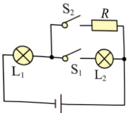
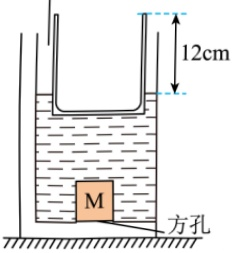
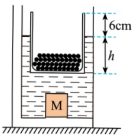
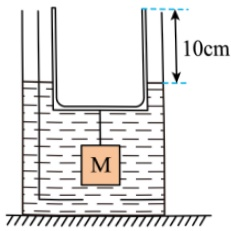
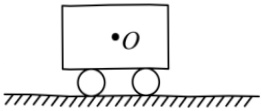
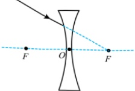

3W”，R 的阻值为10Ω。忽略温度对灯丝电阻的影响，只闭合开关 S₁ 时，灯泡___更亮；只闭合开关 S₂ 时，R 的功率为___W。

13. 小莉模拟古人利用浮力打捞铁牛，模拟过程和测量数据如图所示。①把正方体 M 放在架空水槽底部的方孔处（忽略 M 与水槽的接触面积），往水槽内装入适量的水，把一质量与 M 相等的柱形薄壁水杯放入水中漂浮，如图甲所示；②向杯中装入质量为水杯质量 2 倍的铁砂时，杯底到 M 上表面的距离等于 M 的边长，如图乙所示，此时水杯浸入水中的深度 h=___cm；③用细线连接水杯和 M，使细线拉直且无拉力，再将铁砂从杯中取出，当铁砂取完后，M 恰好可被拉起，完成打捞后，如图丙所示。则 M 与水杯的底面积之比为  $ \frac{S_{M}}{S_{杯}} = $ ___。

架空水槽

甲

乙

丙

14. 请按要求完成下列作图：在图中小车的重心 O 处画出小车所受重力的示意图。

15. 在如图中画出入射光线经凹透镜折射后的光线。

## 三、 实验探究题（本题共3个小题，15小题6分，16小题8分，17小题8分，共22分。）

16. 小帅在探究水沸腾前后温度变化特点 实验中，安装烧杯和温度计时应先确定两者中___的位置；实验过程中，某时刻温度计的示数如图甲所示为___℃；图乙是水的温度随时间变化的关系图象，