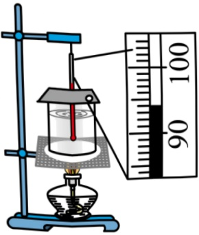
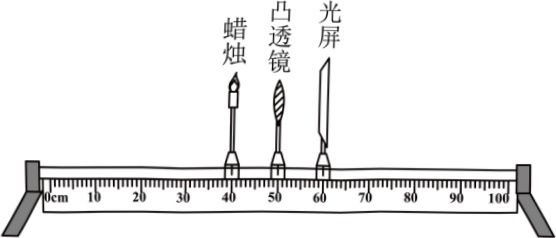
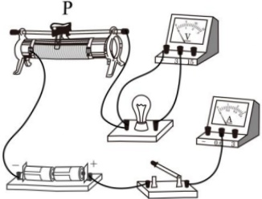
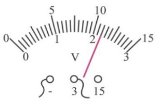

分析图象可知：水在沸腾过程中温度 ___。

甲

<table border=1 style='margin: auto; width: max-content;'>
  <thead><tr><th style='text-align: center;'>t/min</th><th style='text-align: center;'>t/°C</th></tr></thead>
  <tbody>
    <tr><td style='text-align: center;'>0</td><td style='text-align: center;'>90</td></tr>
    <tr><td style='text-align: center;'>0.5</td><td style='text-align: center;'>98</td></tr>
    <tr><td style='text-align: center;'>1</td><td style='text-align: center;'>100</td></tr>
    <tr><td style='text-align: center;'>1.5</td><td style='text-align: center;'>100</td></tr>
    <tr><td style='text-align: center;'>2</td><td style='text-align: center;'>100</td></tr>
    <tr><td style='text-align: center;'>2.5</td><td style='text-align: center;'>100</td></tr>
  </tbody>
</table>

乙

17. 小刚用焦距为  $ 10 \, cm $ 的凸透镜探究凸透镜成像的规律，当蜡烛、凸透镜、光屏三者高度如图所示时，适当调节 ___ 的高度后便可开始实验；当蜡烛距凸透镜  $ 25 \, cm $ 时，移动光屏，在光屏上承接到一个清晰缩小的像，生活中的 ___ 就是根据该成像规律制成的；把蜡烛适当靠近凸透镜，应将光屏 ___ （选填“靠近”或“远离”）凸透镜，才能再次承接到清晰的像。

18. 在测量小灯泡电阻的实验中，小会选用标有“2.5V”字样的小灯泡进行实验。

甲

乙

（1）请用笔画线代替导线，将图甲所示电路补充完整___；

（2）连接电路时，开关应处于___状态。连接好电路，将滑片 P 移至最右端，接通电路后，发现小灯泡不发光，电压表示数约为 3V，其原因可能是小灯泡 ___；

（3）排除故障后，闭合开关，调节滑片P，电压表示数如图乙所示为___V，为测量小灯泡正常发光时的电阻，应将滑片P向___端滑动；