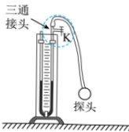
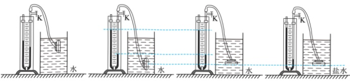

（4）下表是记录的实验数据，则小灯泡正常发光时的电阻约为___Ω（结果保留小数点后1位）；实验中发现灯泡越亮，温度越高，结合数据可知：灯丝温度越高，电阻越___：

<table border=1 style='margin: auto; word-wrap: break-word;'><tr><td style='text-align: center; word-wrap: break-word;'>次数</td><td style='text-align: center; word-wrap: break-word;'>1</td><td style='text-align: center; word-wrap: break-word;'>2</td><td style='text-align: center; word-wrap: break-word;'>3</td><td style='text-align: center; word-wrap: break-word;'>4</td></tr><tr><td style='text-align: center; word-wrap: break-word;'>U/V</td><td style='text-align: center; word-wrap: break-word;'>1</td><td style='text-align: center; word-wrap: break-word;'>2</td><td style='text-align: center; word-wrap: break-word;'>2.5</td><td style='text-align: center; word-wrap: break-word;'>2.8</td></tr><tr><td style='text-align: center; word-wrap: break-word;'>I/A</td><td style='text-align: center; word-wrap: break-word;'>0.18</td><td style='text-align: center; word-wrap: break-word;'>0.28</td><td style='text-align: center; word-wrap: break-word;'>0.30</td><td style='text-align: center; word-wrap: break-word;'>0.31</td></tr></table>

（5）小会在实验过程中发现用力捏滑片与电阻丝接触处，灯泡发光明显变亮。请结合影响导体电阻大小的因素，分析产生这一现象可能的原因是 ___。

19. 小婷在探究液体压强与哪些因素有关的实验中，在 U 形管接头处加装了一个 “三通接头”，如图甲所示。

甲

乙

丙

T

戊

（1）U形管与探头连接时，阀门K应处于___（选填“打开”或“关闭”）状态，以确保U形管内的水面相平；组装完成后，轻压探头的橡皮膜到一定程度，U形管内液面有明显的高度差并保持稳定，说明装置___（选填“漏气”或“不漏气”）；

（2）比较图乙与___两图，可得出液体压强随深度的增加而增大；比较图丙与丁两图，还可初步得出液体在同一深度向各个方向的压强___；

（3）若需通过图丁和戊对比得出液体压强与液体密度的关系，应将图戊中的探头向___移动适当的距离；移动探头后，观察到U形管水面高度差为 $ \Delta h $，此时探头受到盐水的压强为 $ p_{盐} $，小婷取出探头放回水中，当U形管水面高度差再次为 $ \Delta h $时，测出探头在水中的深度为0.2m，则 $ p_{盐} = $ ___ Pa；

（4）小婷发现探头所处深度较浅时，U形管两液面的高度差不明显，可将U形管中的水换成密度更___的液体以方便读数；探究过程中，保持探头所处深度不变，将U形管逐渐向后倾斜，偏离竖直方向，U形管中两液面所对刻度线间的距离将___（选填“变大”“变小”或“不变”）。

## 四、 计算论述题（本题共3个小题，18小题6分，19小题8分，20小题8分，共22分。解题应写出必要的文字说明、步骤和公式，只写出最后结果的不能得分。）

20. 如图所示的电路中，电源电压恒为 2V， $ R_{1} $ 的阻值为 10Ω， $ R_{2} $ 的阻值为 20Ω，闭合开关 S。求：

（1）通过 $ R_{1} $的电流；

（2）通电50s， $ R_{2} $消耗的电能。