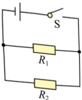
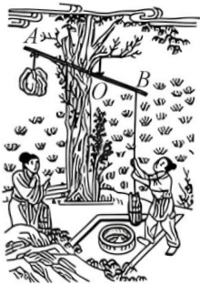

R2

21. 桔槔是《天工开物》中记载的一种原始的汲水工具。如图所示，硬杆用细绳悬挂在树上，杆可绕O点自由旋转且与树之间无作用力，用细绳将重力为20N、容积为 $ 2.8\times10^{-2}\,\text{m}^3 $的桶悬挂在B端，在A端重120N的拗石辅助下，人可轻松将一桶水从井中提起，OA:OB=3:2；悬挂桶的绳子始终保持在竖直方向上，忽略杆和绳的重力。

（1）桶装满水时，求水的质量；

（2）空桶在井中漂浮时，求桶排开水的体积；

（3）一重力为480N的人用桔槔将装满水的桶提出水面后（忽略桶外壁沾水），桔槔处于平衡状态时，人与地面的受力面积为500cm²，求人对地面的压强。

22. 寒假期间，小丽在外婆家发现一闲置的旧电炉（如图甲），铭牌上标有“220V 484W”字样，电炉只有一根电阻丝。为检测电炉能否工作，将其单独接入家庭电路中，观察到表盘如图乙的电能表的指示灯在120s内闪烁了16次，忽略温度对电阻的影响。

（1）求电炉电阻丝的阻值：

（2）求检测时电炉的实际功率；

（3）小丽想为外婆制作一个可调温的发热坐垫。在父母的陪同下，她拆下整根电阻丝并分成两段，将其中一段制作为阻值可调的电阻丝；将两段均可发热的电阻丝接入电源电压恒为  $ 10 \, V $ 的电路中，在通过电阻丝的电流不超过其额定电流的情况下，坐垫的最大功率为  $ 27 \, W $，求发热坐垫在最小功率状态下工作  $ 10 \, s $ 产生的热量。