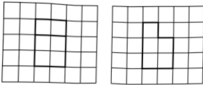
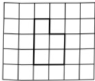
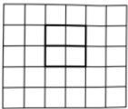

# 2023年普通高等学校招生全国统一考试

# 理科数学

## 一、 选择题

1 设  $ z = \frac{2 + i}{1 + i^2 + i^5} $，则  $ \overline{z} = $ （ ）

A.  $ 1 - 2i $          B.  $ 1 + 2i $          C.  $ 2 - i $          D.  $ 2 + i $

2. 设集合  $ U = \mathbb{R} $，集合  $ M = \{x | x < 1\} $， $ N = \{x | -1 < x < 2\} $，则  $ \{x | x \geq 2\} = $ （ ）

A.  $ \complement_U (M \cup N) $ B.  $ N \cup \complement_U M $

C.  $ \complement_U (M \cap N) $ D.  $ M \cup \complement_U N $

3. 如图，网格纸上绘制的一个零件的三视图，网格小正方形的边长为1，则该零件的表面积为（）

A. 24 B. 26 C. 28 D. 30

4. 已知  $ f(x)=\frac{x\mathrm{e}^{x}}{\mathrm{e}^{ax}-1} $ 是偶函数，则  $ a= $ （ ）

A.  $ -2 $ \quad B.  $ -1 $ \quad C.  $ 1 $ \quad D.  $ 2 $

5. 设 $O$ 为平面坐标系的坐标原点，在区域 $\left\{(x,y)\mid1\leq x^2+y^2\leq 4\right\}$ 内随机取一点，记该点为 $A$，则直线 $OA$ 的倾斜角不大于 $\frac{\pi}{4}$ 的概率为（ ）

A. $\frac{1}{8}$  

B. $\frac{1}{6}$  

C. $\frac{1}{4}$  

D. $\frac{1}{2}$

6. 已知函数  $ f(x) = \sin(\omega x + \varphi) $ 在区间  $ \left(\frac{\pi}{6}, \frac{2\pi}{3}\right) $ 单调递增，直线  $ x = \frac{\pi}{6} $ 和  $ x = \frac{2\pi}{3} $ 为函数  $ y = f(x) $ 的图像的两条对称轴，则  $ f\left(-\frac{5\pi}{12}\right) = (\quad) $