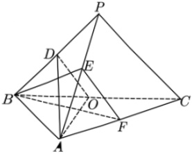

## 三、 解答题

17. 某厂为比较甲乙两种工艺对橡胶产品伸缩率  $ \frac{1}{2} $ 处理效应，进行10次配对试验，每次配对试验选用材质相同的两个橡胶产品，随机地选其中一个用甲工艺处理，另一个用乙工艺处理，测量处理后的橡胶产品的伸缩率，甲、乙两种工艺处理后的橡胶产品的伸缩率分别记为  $ x_{i} $， $ y_{i} $ ( $ i=1,2,\cdots,10 $)，试验结果如下

<table border=1 style='margin: auto; word-wrap: break-word;'><tr><td style='text-align: center; word-wrap: break-word;'>试验序号 i</td><td style='text-align: center; word-wrap: break-word;'>1</td><td style='text-align: center; word-wrap: break-word;'>2</td><td style='text-align: center; word-wrap: break-word;'>3</td><td style='text-align: center; word-wrap: break-word;'>4</td><td style='text-align: center; word-wrap: break-word;'>5</td><td style='text-align: center; word-wrap: break-word;'>6</td><td style='text-align: center; word-wrap: break-word;'>7</td><td style='text-align: center; word-wrap: break-word;'>8</td><td style='text-align: center; word-wrap: break-word;'>9</td><td style='text-align: center; word-wrap: break-word;'>10</td></tr><tr><td style='text-align: center; word-wrap: break-word;'>伸缩率  $ x_i $</td><td style='text-align: center; word-wrap: break-word;'>545</td><td style='text-align: center; word-wrap: break-word;'>533</td><td style='text-align: center; word-wrap: break-word;'>551</td><td style='text-align: center; word-wrap: break-word;'>522</td><td style='text-align: center; word-wrap: break-word;'>575</td><td style='text-align: center; word-wrap: break-word;'>544</td><td style='text-align: center; word-wrap: break-word;'>541</td><td style='text-align: center; word-wrap: break-word;'>568</td><td style='text-align: center; word-wrap: break-word;'>596</td><td style='text-align: center; word-wrap: break-word;'>548</td></tr><tr><td style='text-align: center; word-wrap: break-word;'>伸缩率  $ y_i $</td><td style='text-align: center; word-wrap: break-word;'>536</td><td style='text-align: center; word-wrap: break-word;'>527</td><td style='text-align: center; word-wrap: break-word;'>543</td><td style='text-align: center; word-wrap: break-word;'>530</td><td style='text-align: center; word-wrap: break-word;'>560</td><td style='text-align: center; word-wrap: break-word;'>533</td><td style='text-align: center; word-wrap: break-word;'>522</td><td style='text-align: center; word-wrap: break-word;'>550</td><td style='text-align: center; word-wrap: break-word;'>576</td><td style='text-align: center; word-wrap: break-word;'>536</td></tr></table>

记 $ z_{i}=x_{i}-y_{i}(i=1,2,\cdots,10) $，记 $ z_{1} $， $ z_{2} $，...， $ z_{10} $的样本平均数为 $ \overline{z} $，样本方差为 $ s^{2} $，

（1）求 $ \overline{z} $， $ s^{2} $;

（2）判断甲工艺处理后的橡胶产品的伸缩率较乙工艺处理后的橡胶产品的伸缩率是否有显著提高（如果 $ \overline{z}\geq2\sqrt{\frac{s^{2}}{10}} $，则认为甲工艺处理后的橡胶产品的伸缩率较乙工艺处理后的橡胶产品的伸缩率有显著提高，否则不认为有显著提高）.

18. 在$\triangle ABC$中，已知$\angle BAC=120^\circ$，$AB=2$，$AC=1$。

(1) 求  $ \sin\angle ABC $;

（2）若D为BC上一点，且 $ \angle BAD=90^{\circ} $，求 $ \triangle ADC $的面积.

19. 如图，在三棱锥  $ P-ABC $ 中， $ AB \perp BC $， $ AB=2 $， $ BC=2\sqrt{2} $， $ PB=PC=\sqrt{6} $， $ BP $， $ AP $， $ BC $ 的中点分别为  $ D $， $ E $， $ O $， $ AD=\sqrt{5}DO $，点  $ F $ 在  $ AC $ 上， $ BF \perp AO $。

（1）证明：EF//平面ADO；

（2）证明：平面 $ ADO \perp $平面 $ BEF $;

（3）求二面角D-AO-C的正弦值.